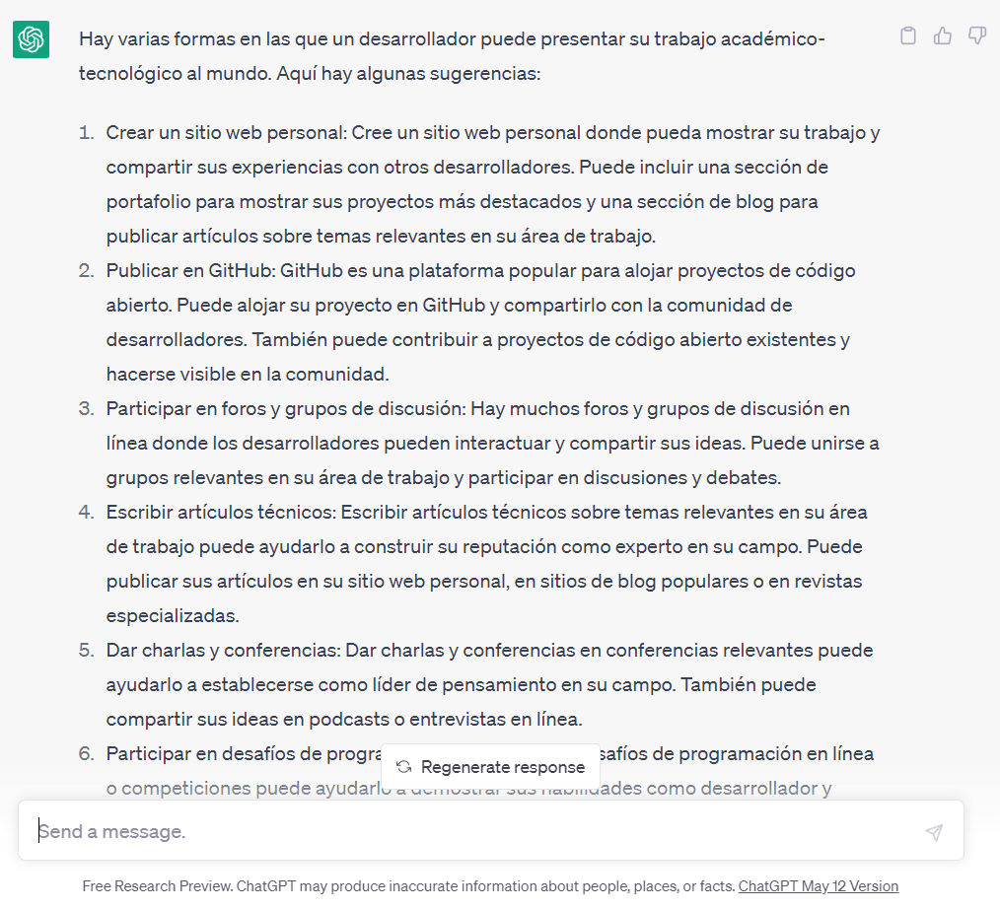

..
  Copyright (c) 2025 Allan Avendaño Sudario
  Licensed under Creative Commons Attribution-ShareAlike 4.0 International License
  SPDX-License-Identifier: CC-BY-SA-4.0

==========================================
Proyecto 01: Repositorio del desarrollador
==========================================

.. topic:: Objetivo general
    :class: objetivo

    Desarrollar un medio para la generación de una identidad digital que facilite la presentación de las habilidades tecnológicas de una manera clara y accesible.

Introducción
=====================

.. admonition:: Prompt

    Como desarrollador, ¿De qué manera puedo compartir mis proyectos técnicos-tecnológicos con el mundo de forma accesible y profesional?

.. toctree::
  :maxdepth: 1
  :caption: Guías
  
  ../guias/guia01.rst