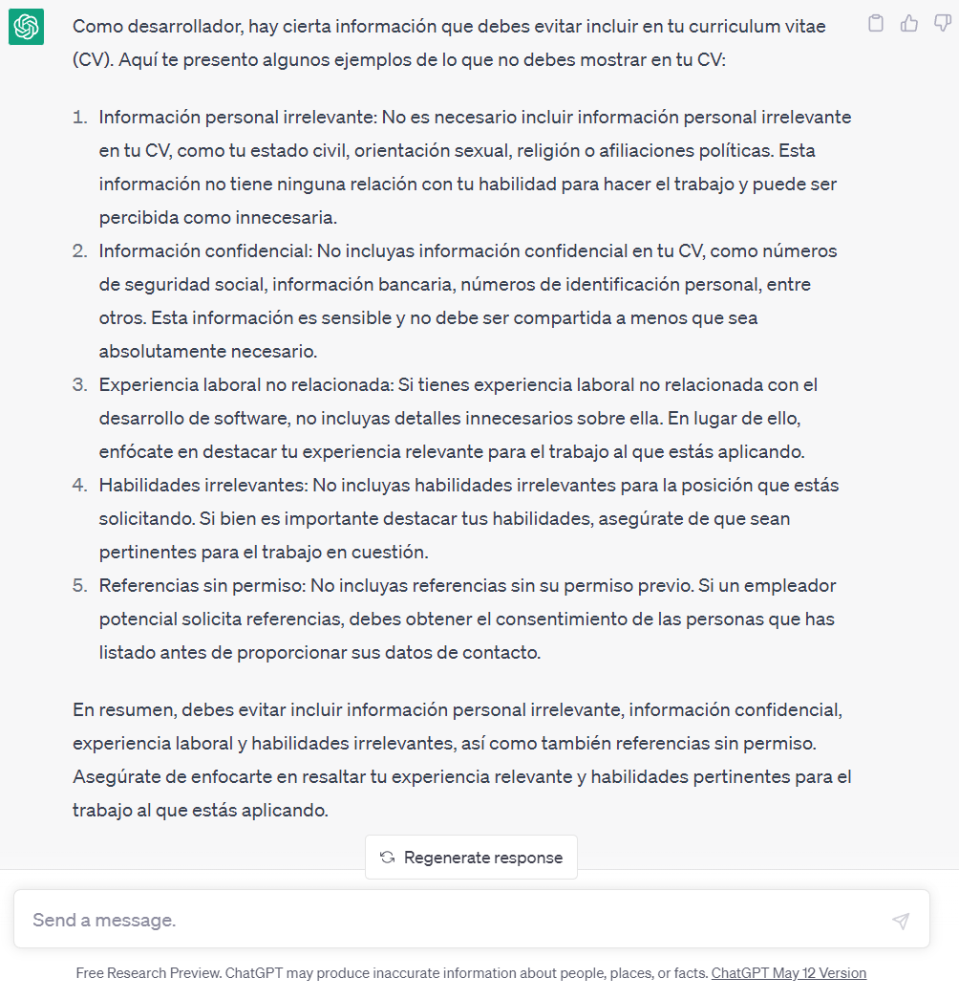

..
  Copyright (c) 2025 Allan Avendaño Sudario
  Licensed under Creative Commons Attribution-ShareAlike 4.0 International License
  SPDX-License-Identifier: CC-BY-SA-4.0

==========================================
Proyecto 02: Curriculum Vitae - HTML & CSS
==========================================

.. topic:: Objetivo general
    :class: objetivo

    Desarrollar un currículum vitae digital que permita presentar información profesional de manera organizada, accesible y visualmente atractiva, mediante el uso adecuado de etiquetas HTML estructurales, semánticas, contenido multimedia e interactivo, así como la aplicación de reglas CSS para mejorar la presentación y la accesibilidad del contenido.

Introducción
======================

.. admonition:: Prompt

    Como desarrollador, ¿Qué tipo de información debo mostrar en mi curriculum vitae?

.. figure:: ./respuestas/proyecto02-respuesta01.png
   :alt: Respuesta a la pregunta 2
   :align: center

.. admonition:: Prompt

    Como desarrollador, ¿Qué tipo de información NO debo mostrar en mi curriculum vitae?

.. toctree::
  :maxdepth: 1
  :caption: Guías
  
  ../guias/guia02.rst
  ../guias/guia03.rst
  ../guias/guia04.rst
  ../guias/guia05.rst