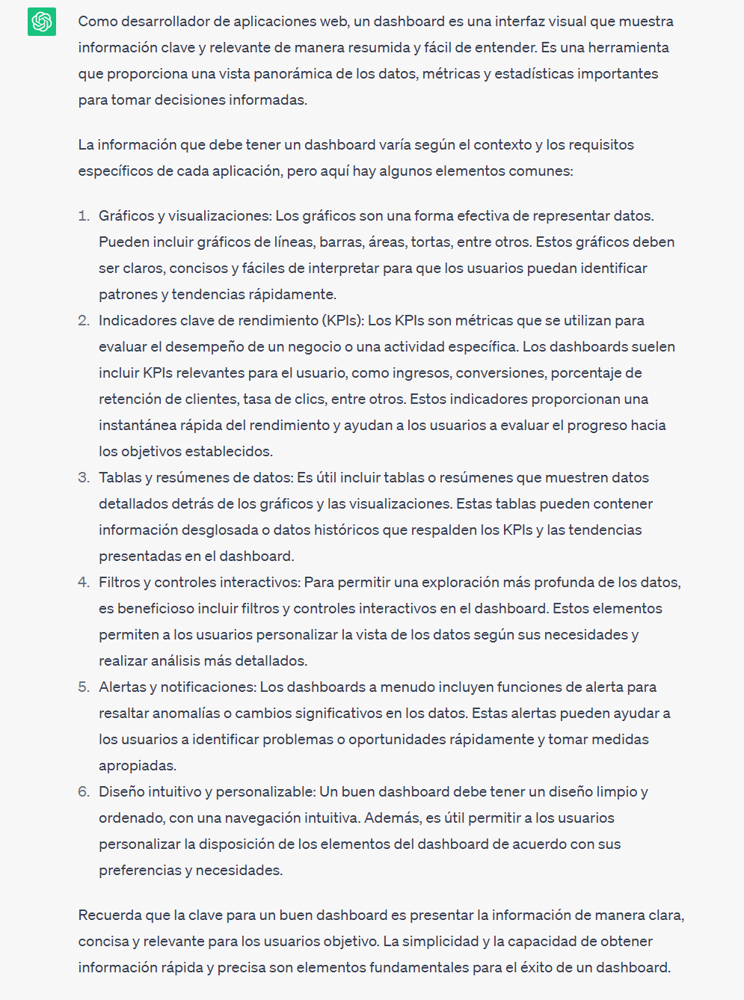

..
  Copyright (c) 2025 Allan Avendaño Sudario
  Licensed under Creative Commons Attribution-ShareAlike 4.0 International License
  SPDX-License-Identifier: CC-BY-SA-4.0
  
==============================
Proyecto 04: Dashboard - React
==============================

.. topic:: Objetivo general
    :class: objetivo

    DesDesarrollar un dashboard interactivo y visualmente intuitivo utilizando tecnologías web modernas, como React y TypeScript, que permita a los usuarios monitorear en tiempo real métricas clave del clima, fomentando la exploración de buenas prácticas de programación y el uso de herramientas actuales en el desarrollo de interfaces dinámicas. 

Introducción
======================

.. admonition:: Prompt

    Como desarrollador de aplicaciones web, ¿Qué es un dashboard y qué información debe tener un dashboard?

.. toctree::
  :maxdepth: 1
  :caption: Guías
  
  ../guias/guia11.rst